# Hydra auction blockchain protocol

The hydra auction blockchain protocol uses:
* three minting policies;
* three non-fungible tokens;
* two fungible tokens;
* seven validator scripts.

The __auction minting policy__ atomically mints (and burns)
three non-fungible tokens.
One of then, __auction metadata token__,
is used to identify non-changeable information about the auction.
The other two are known as auction __state tokens__
and are used to identify two utxos:
* __auction escrow utxo__ that holds
the auction lot in its value
and auction state in its datum;
* __standing bid utxo__ that holds
the initially empty current standing bit.

The __delegate metadata minting policy__ mints
delegate metadata fungible tokens
which are held under the delegate metadata validator
and used to verify available delegate groups
that provide hydra heads.

The __personal oracle minting policy__ mints
fungible tokens which are held under the personal oracle validator
by sellers and bidders
tracking various information parties might publish on-chain.

The auction is controlled by five validators:
* auction escrow;
* auction metadata;
* bidder deposit;
* fee escrow;
* standing bid.

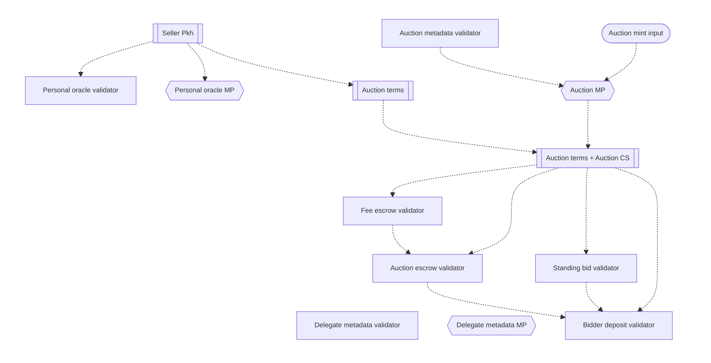

The auction metadata validator,
delegate metadata validator,
and delegate metadata minting policy
are all unparametrized.

The personal oracle validator
and personal oracle minting policy
are both parametrized by the user's pubkey hash
and implemented as native scripts.

The auction minting policy is parametrized on
the auction metadata validator
and on the utxo reference of an input
to the auction minting transaction.

The other four validators are all parameterized
on the auction terms and the auction currency symbol
(and some additionally by other scripts' hashes).

## Announcements, discoverability, and state

All auctions and delegate groups are announced on the L1 blockchain ledger
with all relevant information about them declared
in metadata records held under the non-parametric metadata validators.
This allows any potential participant in the auction protocol
to discover all active auctions and delegate groups just by querying the blockchain.

Personal oracles are used to execute some queries more efficiently:
* list auctions run by a particular seller;
* list auctions where a bidder takes part.

Also, oracles are used to extend the longevity of some data
beyond the point when an auction gets cleaned up on L1.
Particularly, bidder oracles are used
to hold information needed to recover a bidder deposit.

### Delegate group announcement

The purpose of the delegate group announcement is to provide
an official mechanism for a group of delegates to announce
their availability to host auctions on their L2 hydra heads
and provide information about the group.

```haskell
data DelegateInfo = DelegateInfo
  { di'GroupName :: Text
  , di'GroupURL  :: Text
  , di'Delegates :: [PubKeyHash]
  }
```

This announcement transaction mints a delegate metadata token
and outputs a utxo that holds data about the delegate group,
sending it to the delegate metadata validator.

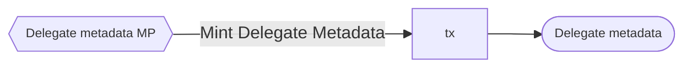

The delegate metadata minting policy ensures that the announcement
is unanimously authorized by the delegates,
while the corresponding validator ensures that the
delegate metadata can only be modified or taken down
by unanimous consent of the delegates.
The delegate metadata contains the pubkey hashes of the delegates,
which is how the two scripts are able to verify delegates' consent.

The output of the delegate group announcement is not
directly referenced or spent by the auction minting policy
or any of the auction validators.
Rather, it exists purely as a mechanism for potential participants
to discover the delegate group via blockchain queries.

To discover all currently existing delegate groups,
query the utxos at the delegate metadata validator address,
and then filter out utxos that don't contain
the delegate metadata token.

### Auction announcement

A seller's auction announcement declares the auction metadata
and initializes the auction by minting
its metadata token and its state tokens.
Metadata token goes to the metadata utxo;
both state tokens go to the auction escrow
along with the auction lot.

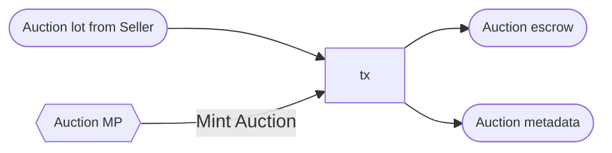

The auction is instantiated by parametrizing its state and metadata tokens,
along with all of its validator scripts,
on the utxo reference of
the input (utxo nonce)
spent to provide the auction lot from the seller
in the announcement transaction.

The auction metadata utxo datum contains
the auction terms,
the currency symbol of the auction policy,
and all of the auction's validator addresses.

```haskell
data AuctionInfo = AuctionInfo
  { ai'AuctionId     :: CurrencySymbol
  -- ^ The auction is uniquely identified by
  -- the currency symbol of the auction MP.
  , ai'AuctionTerms  :: AuctionTerms
  -- ^ The auction terms fully characterize the
  -- behaviour of the auction.
  , ai'AuctionEscrow :: Address
  , ai'BidderDeposit :: Address
  , ai'FeeEscrow     :: Address
  , ai'StandingBid   :: Address
  }
```

To discover all currently existing auctions,
query the utxos at the auction metadata validator address,
filtering out those with invalid auction terms.

### Auction terms

An auction's behaviour is characterized by its **auction terms**,
which are fixed when it is announced.

```haskell
data AuctionTerms = AuctionTerms
  { at'AuctionLot :: AssetClass
  -- ^ NFT being sold in the auction.
  , at'SellerAddress :: Adddress
  -- ^ Seller's address (the payment part should be key-based,
  -- which will receive the proceeds of the auction (minus fees)
  -- if the auction lot is purchased,
  -- or reclaim the auction lot if it isn't.
  , at'SellerVk :: BuiltinByteString
  -- ^ Seller's verification key acts as a gatekeeper
  -- controlling which bidders receive authorization to
  -- participate in the auction.
  , at'Delegates :: [PubKeyHash]
  -- ^ Group of delegates authorized to run the L2 bidding process.
  , at'BiddingStart :: POSIXTime
  -- ^ Start time of the bidding period.
  , at'BiddingEnd :: POSIXTime
  -- ^ End time of the bidding period.
  , at'PurchaseDeadline :: POSIXTime
  -- ^ Time by which the winning bidder can buy the auction lot.
  -- At and after this time, the winning bidder forfeits its bidder deposit
  -- if the auction lot has not been purchased.
  , at'Cleanup :: POSIXTime
  -- ^ Time at and after  which the remaining utxos in the auction
  -- can be unconditionally cleaned up, returning all tokens
  -- in those utxos to their original owners before the auction.
  , at'AuctionFeePerDelegate :: Integer
  -- ^ Fee portion that each delegate will receive from
  -- the proceeds of the auction, whether the auction lot
  -- is purchased by a bidder or reclaimed by the seller.
  , at'StartingBid :: Integer
  -- ^ Bids cannot be lower than this number.
  , at'MinimumBidIncrement :: Integer
  -- ^ New bids can only supersede the standing bid if they exceed it
  -- by this increment.
  , at'MinDepositAmount :: Integer
  -- ^ Minimal amount of ADA that the seller requests
  -- each bidder to place as a bidder deposit for the auction.
  -- This is only enforced off-chain at the seller's discretion.
  }
```

Auction terms are validated on-chain upon minting
auction metadata and state tokens and cannot be changed.
Terms are considered to be valid if the following conditions hold:

```haskell
validAuctionTerms :: AuctionTerms -> Bool
validAuctionTerms auTerms@AuctionTerms {..} =

  -- Auction lot must not include any ADA.
  adaOf at.AuctionLot == 0 &&

  -- All amounts in the auction lot must be positive.
  valuePositive at'AuctionLot &&

  -- The payment part of the seller's address is a PKH.
  isJust $ addrPaymentKeyHash at'SellerAddress

  -- Bidding ends after the bidding starts.
  at'BiddingStart < at'BiddingEnd &&

  -- The purchase deadline occurs after bidding ends.
  at'BiddingEnd < at'PurchaseDeadline &&

  -- Cleanup happens after the purchase deadline,
  -- so that the seller can claim the winning bidder's deposit
  -- if the auction lot is not sold
  at'PurchaseDeadline < at'Cleanup &&

  -- New bids must be larger than the standing bid.
  at'MinimumBidIncrement > 0 &&

  -- The auction fees for all delegates must be covered by the starting bid.
  at'StartingBid > totalAuctionFees auTerms &&

  -- The auction fee for each delegate must contain
  -- the min 2 ADA for the utxos that will be sent to the delegates
  -- during fee distribution.
  at'AuctionFeePerDelegate > 2_000_000 &&

  -- There must be at least one delegate.
  length at'Delegates > 0

totalAuctionFees :: AuctionTerms -> Integer
totalAuctionFees AuctionTerms {..} =
  at'AuctionFeePerDelegate * length at'Delegates
```

Subject to these validity conditions,
the seller can set the auction terms according to the seller's preferences.

The seller should set the `at'Delegates` field
to one of the delegate groups that the seller discovers
by querying the announced delegate groups.

We do not require `at'SellerAddress` matches `at'SellerVk`.
In some sense, these two represent different roles.
The seller can use the same or different credentials
at their discretion:
* `at'SellerAddress` represents a beneficiary
who receives the proceeds of an auction
and manages a seller's oracle.
* `at'SellerVk` acts as an auction gatekeeper
checking bidders' authorization.

### Auction state and utxo datums

For any auctions of interest,
anyone can discover their current L1 state by
querying the utxos at their corresponding validator addresses
that are listed in the auction metadata.

The state of the auction protocol is contained in the
auction escrow, standing bid, and bidder deposits' utxo datums:

```haskell
-- 1. Auction escrow - holds the state in datum (and the lot in the value).
type AuctionEscrowDatum = AuctionEscrowState

data AuctionEscrowState = AuctionAnnounced
                        | BiddingStarted
                        | AuctionConcluded

-- 2. Standing bid - represented initially empty `BidTerms`.
type StandingBidDatum = StandingBidState

newtype StandingBidState = StandingBidState
  { standingBidState :: Maybe BidTerms }

-- 3. Bidder deposit outputs lock deposits
-- along with info about the bidder that made it.
type BidderDepositDatum = BidderInfo

-- 3. Doesn't carry any information.
type FeeEscrowDatum = ()
```

The auction escrow and standing bid state can change
over the lifecycle of the auction
and they are uniquely identified
by the non-fungible auction state tokens that their utxos hold
(policy id `ai'AuctionId`, token names `AUCTION` and `STANDING_BID`).
All other utxos with no state tokens under
the auction escrow and standing bid addresses
must be ignored as illegitimate.

The location of the standing bid token determines
if and where bids can be placed in the auction:

- If it's at the auction escrow address on L1 (the initial disposition),
then bids cannot be placed yet.
- If it's at the standing bid address on L1,
then bids can be placed on L1.
- Otherwise, it's in a hydra head on L1
and at the standing bid address on L2,
so bids should be placed on L2 via requests sent to the delegates.

Bidder deposits are not uniquely identified by any non-fungible tokens,
and bidder information is fixed when its deposit utxo is created.

### Bidder deposits

To indicate an interest in participating in an auction,
each bidder should deposit some ADA
under the auction's bidder deposit validator,
identifying the bidder in the bid deposit's utxo datum.

```haskell
data BidderInfo = BidderInfo
  { bi'BidderAddress :: Address
  -- ^ Bidder's address, which can spend this bidder's deposit
  -- and buy the auction lot if a bid placed by bi'BidderVk wins
  -- or reclaim this deposit otherwise.
  , bi'BidderVk :: ByteString
  -- ^ Bidder's verification, which can authorize bids that allow
  -- the seller at'SellerAddress to claim this bidder deposit
  -- if the bid placed by bi'BidderVk won but the auction lot
  -- wasn't purchased by the deadline.
  }
```

In the auction terms, the seller defines
the minimum ADA amount (`at'MinDepositAmount`)
that he expects to see in bidder deposits
to consider allowing those bidders to participate.

If a bidder places a winning bid in the auction
but does not purchase the auction lot by the deadline,
then the winning bidder's deposit is forfeited to the seller.
This doesn't guarantee that the winning bid will be honored in the auction,
but the bid deposit can compensate the seller
for the waste of time caused by the bidder's unserious bid.

Again, a bidder can use `bi'BidderAddress` and `bi'BidderVk`
based on the same key or not. They represent two different roles respectively:
* `bi'BidderAddress` acts as buyer/guarantor
who is expected to buy the lot in the case of a win;
* `bi'BidderVk` authorizes the bids.

### Authorization by seller

In a private auction, the seller controls
who is allowed to place bids.
To authorize a bidder to participate in the auction,
the seller signs a serialized tuple `(auctionId, bidderVk)`
describing the bidder (via verification key)
and the auction (via the currency symbol) 
that the bidder can participate in.
This signature can be verified
via the seller's verification key (`at'SellerVk`),
which is included in the auction terms.
Once issued, a bidder-auction signature cannot be revoked by the seller
— the bidder is free to continue using it to play new bids in the auction.

The seller should authorize bidders with sufficient deposits
to participate in the auction,
but has full discretion to grant or withhold authorization
to anyone for any reason.

To inform bidders that they have authorization,
the seller publishes bidder-auction authorization signatures
via a personal oracle.
To publish a new list of bidder-auction authorization signatures
`[(signature, auctionId, bidderVk)]`,
the seller mints a new personal oracle token
and place it under his personal oracle validator
into a utxo containing the list in the datum.
The seller can do this as many times as needed,
publishing different lists of signatures each time.

To discover the bidder-auction authorizations from the seller,
query the seller's personal oracle address
and filter out utxos that don't contain
the seller's personal oracle token
and/or don't relate to the auction based on `auctionId`

Overall, this is a completely optional mechanism for the seller to
communicate authorization to bidders for auction participation.
In principle, the auction app could just as easily generate
a QR code that the seller could share on Discord, Twitter,
WhatsApp, etc.

```haskell
type SellerOracleDatum = AuctionAuth

type Signature = ByteArray

data AuctionAuth = AuctionAuth
  { auctionCs :: CurrencySymbol
  , signatures :: [(VerificationKey, Signature)
  }
```

### Bid terms and authorization by bidder

Every bid placed in the auction must identify
the bidder and bid price.
It must also provide signatures proving
that the seller authorized the bidder to participate
and that the bidder authorized the bid.

```haskell
data BidTerms = BidTerms
  { bt'Bidder :: BidderInfo
  -- ^ Bidder that submitted the bid.
  , bt'BidPrice :: Integer
  -- ^ Price that the bidder bid to buy the auction lot.
  , bt'BidderSignature :: BuiltinByteString
  -- ^ Bidder's signature (via bi'BidderVk . bt'Bidder) of the
  -- (ai'AuctionId, bt'BidPrice, bi'BidderAddress) tuple,
  -- authorizing a bid at that price to be placed in the auction
  -- and bi'BidderAddress to buy the auction lot if the bid wins.
  , bt'SellerSignature :: BuiltinByteString
  -- ^ Seller's signature (via at'SellerVk) of the
  -- (ai'AuctionId, bi'BidderVk) tuple,
  -- authorizing the bidder bi'BidderVk to place bids in the auction.
  }
```

Bid terms can be verified on-chain or off-chain as follows:

```haskell
validBidTerms :: AuctionTerms -> CurrencySymbol -> BidTerms -> Bool
validBidTerms AuctionTerms {..} auctionId BidTerms {..}
  | BidderInfo {..} <- bt'Bidder =

  -- The seller authorized the bidder to participate
  verifyEd25519Signature at'SellerVk
    (sellerSignatureMessage auctionId bi'BidderVk)
    bt'SellerSignature &&

  -- The bidder authorized the bid
  verifyEd25519Signature bi'BidderVk
    (bidderSignatureMessage auctionId bt'BidPrice bi'bidderAddress)
    bt'BidderSignature

bidderSignatureMessage
  :: CurrencySymbol
  -> Integer
  -> PubKeyHash
  -> BuiltinByteString
bidderSignatureMessage auctionId bidPrice bidderAddress =
  toByteString auctionId <>
  toByteString bidderAddress <>
  toByteString bidPrice

sellerSignatureMessage
  :: CurrencySymbol
  -> BuiltinByteString
  -> BuiltinByteString
sellerSignatureMessage auctionId bidderVk =
  toByteString auctionId <>
  bidderVk
```

## Minting policies

### Auction minting policy

The purpose of the auction metadata token and two auction state tokens is
to provide an unbroken path of provenance
from the auction lot input of the auction announcement transaction
(which instantiates the auction)
to the unique auction metadata,
auction escrow,
and standing bid utxos of the auction.

Furthermore, the auction minting policy requires
all of these tokens to be minted together and burned together;
since these three tokens are continuously held
under auction protocol validators for the entire lifecycle of the auction,
this also means that the minting policy ensures their continued existence
for that entire lifecycle.

```haskell
data AuctionPolicyRedeemer = MintAuction
                           | BurnAuction
```

The token names of this minting policy are as follows:

```haskell
-- Auction metadata token, identifying the true auction metadata.
-- To be used with auction metadata validator.
auctionMetadataTN :: TokenName
auctionMetadataTN = "AUCTION_METADATA"

-- Two auction state tokens.

-- Auction state token, identifying the true auction escrow.
-- To be used with auction escrow validator.
auctionTN :: TokenName
auctionTN = "AUCTION"

-- Standing bid token, identifying the true standing bid.
-- To be used wit standing bid validator.
standingBidTN :: TokenName
standingBidTN = "STANDING_BID"
```

Under the `MintAuction` redeemer, we enforce that:

- The utxo nonce parameter of the minting policy refers to a transaction input.
- There are three tokens minted.
They have the minting policy's own currency symbol
and the token names
`auctionTN` (auction state token),
`auctionMetadataTN` (auction metadata token),
and `standingBidTN` (standing bid token).
- The auction metadata token is sent to the auction metadata validator within the only output.
- The auction info datum contains an auction ID
that matches policy's own currency symbol.
- The auction metadata record contains valid auction terms.

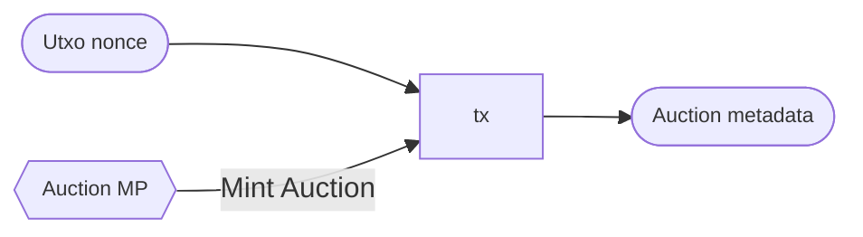

Under the `BurnAuction` redeemer, we enforce that:

- There are three tokens burned.
They have the minting policy's own currency symbol
and the token names
`auctionTN` (auction state token),
`auctionMetadataTN` (auction metadata token),
and `standingBidTN` (standing bid token).

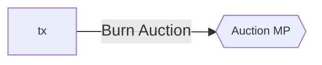

Note that the auction minting policy doesn't
ensure that the auction state tokens are sent
to the appropriate auction protocol validators.

### Delegate metadata minting policy

The purpose of this minting policy is to verify that
a `DelegateInfo` datum posted to the delegate metadata validator
has unanimous consent from all delegates that it declares.

```haskell
data DelegateMetadataPolicyRedeemer = MintDelegateMetadata
                                    | BurnDelegateMetadata
```

The token names of this policy are as follows:

```haskell
delegateMetadataTN :: TokenName
delegateMetadataTN = "DELEGATE_METADATA"
```

Under the `MintDelegateMetadata` redeemer, we enforce that:

- There is one token minted.
It has the minting policy's own currency symbol
and the token name `delegateMetadataTN` (delegate metadata token).
- There is one output sent to the delegate metadata validator,
containing the minted token.
Its `DelegateInfo` datum satisfies the `validDelegateInfo` conditions.
- The transaction is signed  all of the pubkey hashes
indicated in the `di'Delegates` field of the `DelegateInfo` output datum.

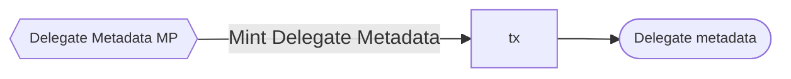

Under the `BurnDelegateMetadata` redeemer, we enforce that:

- There is one token burned.
It has the minting policy's own currency symbol
and the token name `delegateMetadataTN` (delegate metadata token).
- There is one input from the delegate metadata validator,
containing the burned token and a `DelegateInfo` datum.
- The transaction is signed by all of the pubkey hashes
indicated in the `di'Delegates` field of the `DelegateInfo` input datum.


## Auction state validators

### Auction escrow validator

The purpose of the auction escrow validator is
to hold the auction lot once the auction announcement,
until either the winning bidder buys it
or the seller reclaims it.

This validator is parametrized by three parameters:
* the currency symbol of the auction non-fungible tokens.
All references to "the auction state token"
"the standing bid token",
or "the auction metadata token" below
imply tokens with this currency symbol.
* the auction terms;
* the hash of the fee escrow script;

The utxo datum contains the current state of the auction.
When the auction is announced,
the seller should initialize the auction escrow datum
as `AuctionAnnounced :: AuctionEscrowState`.

The validator supports four redeemers:

```haskell
data AuctionEscrowRedeemer = StartBidding
                           | SellerReclaims
                           | BidderBuys
                           | CleanupAuction
```

Under the `StartBidding` redeemer, we enforce that:

- There is one input spent from the auction escrow validator,
containing the auction lot,
the auction state token,
and the standing bid token.
Its `AuctionEscrowState` datum is `AuctionAnnounced`.
- There is one output sent to the auction escrow validator,
containing the auction lot and the auction state token.
Its `AuctionEscrowState` datum is `BiddingStarted`.
- There is one output sent to the standing bid validator,
containing the standing bid token.
Its `StandingBidState` datum is `StandingBidState Nothing`.
- The transaction validity interval starts
at the bidding start time
and ends before the bidding end time.
- The transaction is signed by the seller `at'SellerAddress`.
- No tokens are minted or burned.

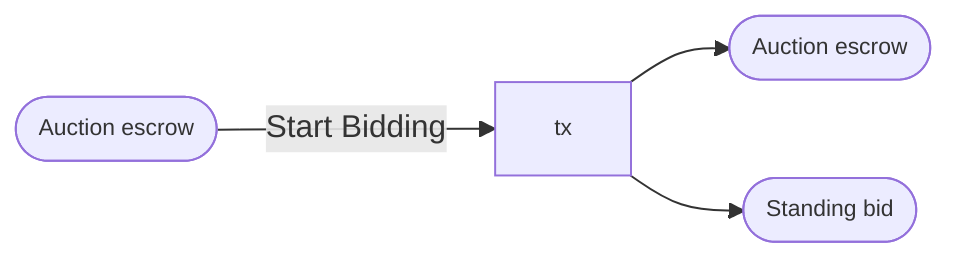

Under the `SellerReclaims` redeemer, we enforce that:

- There is one input spent from the auction escrow validator,
containing the auction lot and the auction state token.
Its `AuctionEscrowState` datum is `BiddingStarted`.
- There is one input spent from the standing bid validator,
containing the standing bid token.
- There is one output sent to the auction escrow validator,
containing the auction state and standing bid tokens.
Its `AuctionEscrowState` datum is `AuctionConcluded`.
- There is one output sent to the seller,
containing the auction lot.
- There is one output sent to the fee escrow validator,
containing the total auction fees
that will be distributed to the delegates,
as calculated by `totalAuctionFees`.
- The transaction validity interval
starts at the purchase deadline time.
- The transaction is signed by the seller `at'SellerAddress`.
- No tokens are minted or burned.

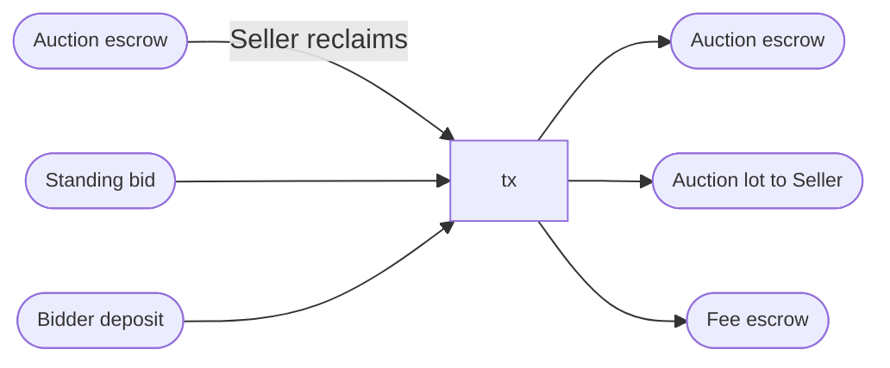

Under the `BidderBuys` redeemer, we enforce that:

- There is one input spent from the auction escrow validator,
containing the auction lot and the auction state token.
Its `AuctionEscrowState` datum is `BiddingStarted`.
- There is one input spent from the standing bid validator,
containing the standing bid token.
Its `StandingBidState` datum contains a bid with `BidTerms`
defining the bidder and the bid price.
- There is one output sent to the auction escrow validator,
containing the auction state and standing bid tokens.
Its `AuctionEscrowState` datum is `AuctionConcluded`.
- There is one output sent to a buyer,
containing the auction lot.
- There is one output sent to the seller,
containing an ADA payment to the seller.
- There is one output sent to the fee escrow validator,
containing the total auction fees
that will be distributed to the delegates,
as calculated by `totalAuctionFees`.
- The conditions in `validBuyer` and `validSellerPayment`
are satisfied when applied to the relevant arguments.
- The transaction validity interval
starts at the bidding end time
and ends before the purchase deadline time.
- The transaction in signed by the biddeer.
- No tokens are minted or burned.

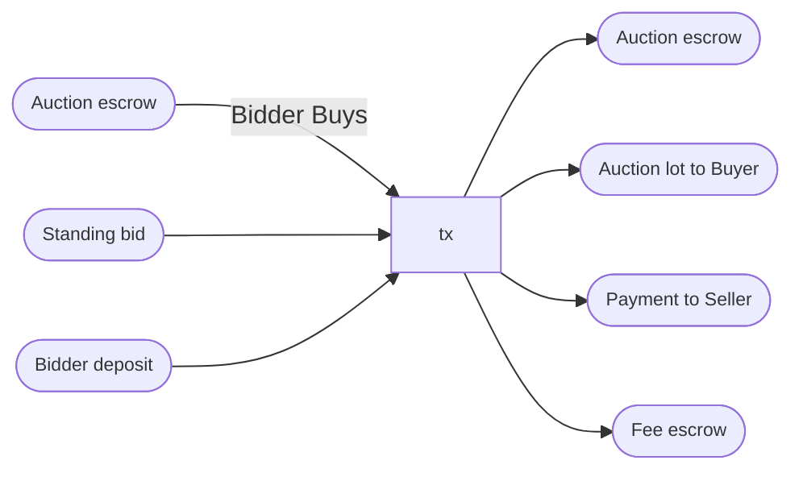

The conditions for a valid buyer and a valid payment to the seller are:

```haskell
validBuyer
  :: AuctionTerms
  -> CurrencySymbol
  -> StandingBidState
  -> PubKeyHash
  -> Bool
validBuyer auTerms@AuctionTerms{..} auctionId StandingBidState{..} buyer
  | Just bidTerms@BidTerms{..} <- standingBidState
  , BidderInfo {..} <- bt'Bidder =
      buyer == bi'BidderPkh &&
      validBidTerms auTerms auctionId bidTerms
  | otherwise = False

validPaymentToSeller
  :: AuctionTerms
  -> StandingBidState
  -> Int
  -> Bool
validPaymentToSeller auTerms StandingBidState {..} payment
  | Just BidTerms{..} <- standingBidState =
      payment >= bt'BidPrice - totalAuctionFees auTerms
  | otherwise = False
```

Under the `CleanupAuction` redeemer, we enforce that:

- There is one input spent from the auction escrow validator,
containing the auction state and standing bid tokens.
Its `AuctionEscrowState` datum is `AuctionConcluded`.
- There are three tokens burned:
the auction state token,
the standing bid token,
and the auction metadata token.
- No other tokens are minted or burned.
- The transaction validity interval
starts at the cleanup time.
- The transaction is signed by the seller.

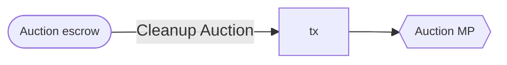

### Standing bid validator

The purpose of the standing bid validator is to
manage the state transitions of the standing bid
and to continuously maintain control over
the standing bid token
until it its spent when either
the seller reclaims the auction lot
or the winning bidder buys it.

Parameterized with autcion terms and the auction's currency symbol.

```haskell
data StandingBidRedeemer = MoveToHydra
                         | NewBid
                         | ConcludeAuction
```

Under the `MoveToHydra` redeemer, we enforce that:

- There is one input from the standing bid validator,
containing the standing bid token.
- The transaction is signed by all of the delegates `at'Delegates`.
- No tokens are minted or burned.

Under the `NewBid` redeemer, we enforce that:

- There is one input from the standing bid validator,
containing the standing bid token.
Its `StandingBidState` datum is the old standing bid state.
- There is one output to the standing bid validator,
containing the standing bid token.
Its `StandingBidState` datum is the new standing bid state.
- The conditions in `validNewBid` are satisfied
when applied to the relevant arguments.
- The transaction validity range ends before the bidding end time.
- No tokens are minted or burned.

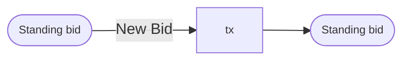

The conditions for a valid transition in the standing bid state are:

```haskell
validNewBid
  :: AuctionTerms
  -> CurrencySymbol
  -> StandingBidState
  -> StandingBidState
  -> Bool
validNewBid auTerms@AuctionTerms {..} auctionId old new =
  case standingBidState new of
    Nothing ->
      False
    Just newTerms ->
      validNewTerms auTerms auctionId newTerms &&
      case standingBidState old of
        Nothing ->
          validStartingBid auTerms newTerms
        Just oldTerms ->
          validBidIncrement auTerms oldTerms newTerms

validStartingBid :: AuctionTerms -> BidTerms -> Bool
validStartingBid AuctionTerms {..} BidTerms {..} =
  at'StartingBid <= bt'BidPrice

validBidIncrement :: AuctionTerms -> BidTerms -> BidTerms -> Bool
validBidIncrement AuctionTerms {..} old new =
  bt'BidPrice old + at'MinimumBidIncrement <= bt'BidPrice new
```

Under the `ConcludeAuction` redeemer, we enforce that:

- There is one input from the standing bid validator,
containing the standing bid token.
- There is one input from the auction escrow validator,
containing the auction state token being spent with the
`BidderBuys` or `SellerReclaims` redeemer,
which means the auction has been concluded.

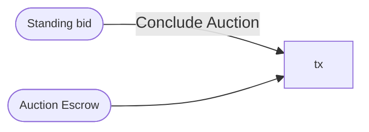

### Bidder deposit validator

The purpose of the bidder deposit validator is
to hold a bidder's ADA deposit for an auction until either:

- The bidder wins and uses the deposit to buy the auction lot.
- The seller claims the deposit
because the bidder won the auction
but did not purchase the auction lot by the deadline.
- The bidder reclaims the deposit
because another bidder won the auction.
- The bidder reclaims the deposit
because the auction has already concluded.

The validator is parameterized with four parameters:
* the hash of the standin bid validator;
* the hash of the auction escrow validator;
* the currency symbol of the auction non-fungible tokens;
* the auction terms.

The validator supports five reddemers:

```haskell
data BidderDepositRedeemer = DepositUsedByWinner
                           | DepositClaimedBySeller
                           | DepositReclaimedByLoser
                           | DepositReclaimedAuctionConcluded
                           | DepositCleanup
```

Under the `DepositUsedByWinner` redeemer, we enforce that:

- There is only one input spent from the bid deposit validator.
Its `BidderInfo` datum defines the bidder.
- There is only one input spent from the auction escrow validator,
containing the auction state token
and being spent with the `BidderBuys` redeemer.
- There is only one standing bid input,
containing the standing bid token.
- The bidder deposit's bidder won the auction
(i.e. the bid is the standing bid).
- No tokens are minted or burned.

Under the `DepositClaimedBySeller` redeemer, we enforce that:

- There is one input spent from the bid deposit validator.
- There is one input spent from the auction escrow validator,
containing the auction state token.
- The auction escrow input is being spent with
the `SellerReclaims` redeemer.
- There is one input spent from the standing bid validator,
containing the standing bid token.
- The bidder deposit's bidder won the auction.
- The transaction validity interval starts at the purchase deadline.
- No tokens are minted or burned.

Under the `DepositReclaimedByLoser` redeemer:

- There is one input spent from the bid deposit validator.
- There is one reference input from the standing bid validator,
containing the standing bid token.
- The bidder deposit's bidder lost the auction
i.e. the bidder verification key _doesn't match_ between
the bidder deposit and the standing bid.
- The transaction validity interval starts at the bidding end time.
- The payment part of the bidder address should be a pubkey hash.
- The transaction is signed by the bidder.
- No tokens are minted or burned.

Under the `DepositReclaimedAuctionConcluded` redeemer, we enforce that:

- There is one input spent from the bid deposit validator.
- The auction escrow reference input should contain the auction
escrow token and standing bid token.
- Its `AuctionEscrowState` datum is `AuctionConcluded`.
- The payment part of the bidder address should be a pubkey hash.
- The transaction is signed by the bidder.
- No tokens are minted or burned.

Under the `DepositCleanup` redeemer, we enforce that:

- There is one input spent from the bid deposit validator.
- The transaction validity time starts after the cleanup time.
- The payment part of the bidder address should be a pubkey hash.
- The transaction is signed by the bidder.
- No tokens are minted or burned.

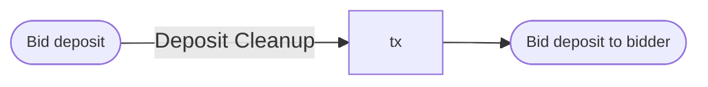

### Fee escrow validator

The purpose of this validator is to distribute the total auction fees
evenly among the delegates, after deducting the transaction fee.

The validator is parameterized by the auction currency symbol
and the action terms.

Under the `DistributeFees` redeemer, we enforce that:

- There is one input spent from the fee escrow validator.
- There is at least one output per delegate such that
the ada contained in that output is at least `at'AuctionFeePerDelegate`
- No tokens are minted or burned.

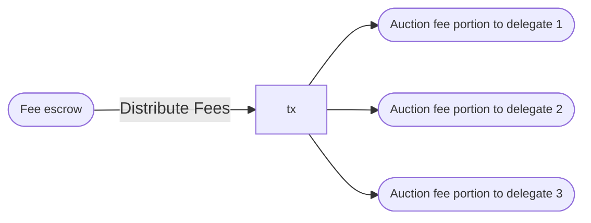

To keep things simple in this design, we require
the number of delegates in an auction to be small enough
that distributing their respective portions of the auction fee
can be done in a single transaction.
Later on, this can be generalized in a straightforward way
to accommodate incremental fee distribution to a larger number of delegates.

## Metadata and oracle validators

### Auction metadata validator

The purpose of this validator is to ensure that
the auction metadata remains unmodified and
the auction metadata token remains under its control
until it is burned (together with the auction state tokens).

```haskell
data AuctionMetadataRedeemer = RemoveAuction
```

Under the `RemoveAuction` redeemer, we enforce that:

- There is one input from the auction metadata validator,
containing one auction metadata token.
- There are three tokens burned:
the auction state token,
the standing bid token,
and the auction metadata token.

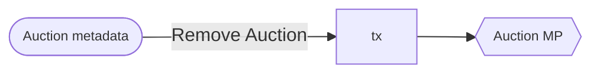
### Delegate metadata validator

The purpose of this validator is to ensure that
the delegate metadata continuously stays under its control
until it is burned (with unanimous consent of the delegates),
and that the delegate metadata is only modified
with unanimous consent of the delegates.

```haskell
data DelegateMetadataRedeemer = ModifyDelegateMetadata
                              | RemoveDelegateMetadata
```

Under the `ModifyDelegateMetadata` redeemer, we enforce that:

- There is one input from the delegate metadata validator,
containing one delegate metadata token and a `DelegateInfo` datum.
- There is one output to the delegate metadata validator,
containing one delegate metadata token and a `DelegateInfo` datum.
- No tokens are minted or burned.
- The transaction is signed by all of the pubkey hashes
indicated in the `di'Delegates` field of the `DelegateInfo` input datum.

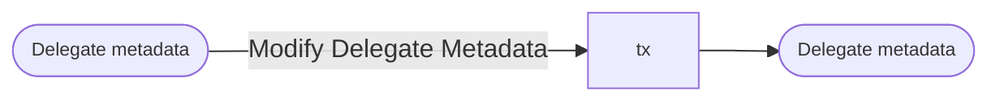

Under the `RemoveDelegateMetadata` redeemer, we enforce that:

- There is one input from the delegate metadata validator,
containing one delegate metadata token.
- There is one token burned — the delegate metadata token.


### Personal oracle minting policy and validator

Personal oracles can be used by sellers and buyers
to publish various types of information on-chain,
like bidders authorizations
and so on.

The oracle minting policy is a native script
based on a PKH that owns the oracle.
Tokens under that policy are fungible
thus allowing multiple outputs to exist.
To tell apart different types of data
token names are used as discriminators.

The oracle validator is also a native script
based on the same PKH that the policy.
Outputs under this validator can be desptoyed by the oracle's owner, whenever desired.

Currently the following token names and datatypes
are used in the protocol.

```haskell

-- Publish authorized bidders, token name: `AUCTION_AUTH`
newtype AuctionAuth = AuctionAuth
  { auctionCs :: CurrencySymbol
  , signatures :: Array (Tuple VerificationKey ByteArray)
  }

-- Announce the party's participation in an auction,
-- used for more efficient queries, token name: `AUCTION_ACTOR`
data AuctionActor = AuctionActor
  { auctionInfo :: AuctionInfo
  , role :: ActorRole
  }

data ActorRole = Seller | Bidder

-- To guarantee that bidders are still able to reclaim their deposits
-- during the cleanup period after all auction's tokens are burned,
-- we store the bidder deposit validator address
-- which is a part of 'AuctionInfo' in a bidder's oracle
-- along with tokens named `BIDDER_DEPOSIT`
data BidderDeposit = BidderDeposit
  { bd'Address :: Address
  }

```
